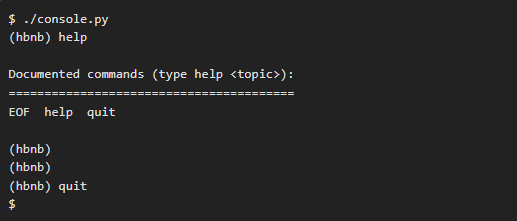
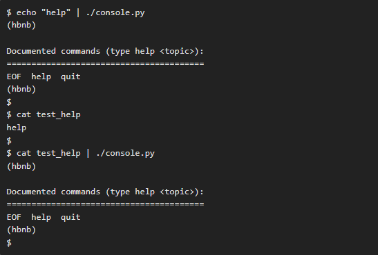

# The AirBnB clone project!

# description of the project
This is the first step towards building your first full web application:
    The AirBnB clone. This first step is very important
because you will use what you build during this project
with all other following projects HTML/CSS templating
database storage, API, front-end integration

# description of the command interpreter
This is a command interpreter that acts as the frontend of the app,
Allowing users to add or delete entries from the database.
Users can interact with the backend, giving them the ability to manipulate data
and objects within the app, such as:
    - User
- State
- City
- Place
- Reviews
- Amenities

# how to start it
- To start you need Linux Ubuntu
- To start you need Python 3

# how to use it
There are two diferent mode to work

+ Interactive
+ Non-interactive

# Your shell should work like this in interactive mode:

# In non-interactive mode, your shell will be something like this:

# Files
- Amenity: models/amenity.py
- BaseModel: models/base_model.py
- City: models/city.py
- FileStorage: models/engine/file_storage.py
- MyCommand: console.py
- Place: models/place.py
- Review: models/review.py
- State: models/state.py
- User: models/user.py
- engine.init: models/engine/init.py
- models.init: models/init.py  # AirBnB_clone

# Authors
Omar Morsi | [Info](Pop2323)
